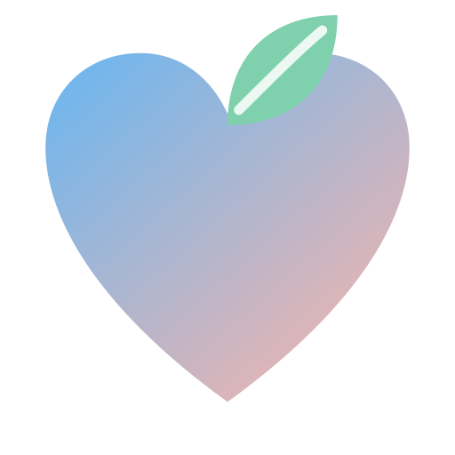

  

<h1 align="center">Kinovy Feedback</h1>

Welcome, and thank you for helping make Kinovy kinder.

**Kinovy** is a cross-platform app for people living with chronic conditions. It
pairs a low-effort daily check-in with a supportive community feed. Made with
care in Guatemala.

- Website: https://kxdrsrt.github.io/kinovy-app/
- This repo is where we track public feedback, bug reports, and ideas.

## How to help

- **Found a bug?** [Open a bug report](https://github.com/kxdrsrt/kinovy-feedback/issues/new?template=bug_report.yml).
- **Have an idea?** [Suggest a feature](https://github.com/kxdrsrt/kinovy-feedback/issues/new?template=feature_request.yml).
- **Just want to say something?** [Start a general issue](https://github.com/kxdrsrt/kinovy-feedback/issues/new).

Before opening a new issue, a quick look through
[existing issues](https://github.com/kxdrsrt/kinovy-feedback/issues) helps us
avoid duplicates.

## A note on kindness

Kinovy exists for people on hard days. Please keep that spirit here too. Be
gentle, assume good intent, and skip anything that shares personal contact
details or medical advice. We read everything and reply as we can.

## Privacy

The Kinovy app is local-first: your daily logs stay on your device. This
feedback space is public, so please do not post private health information here.

---

Kindness is what keeps us together. Not a replacement for professional care.
